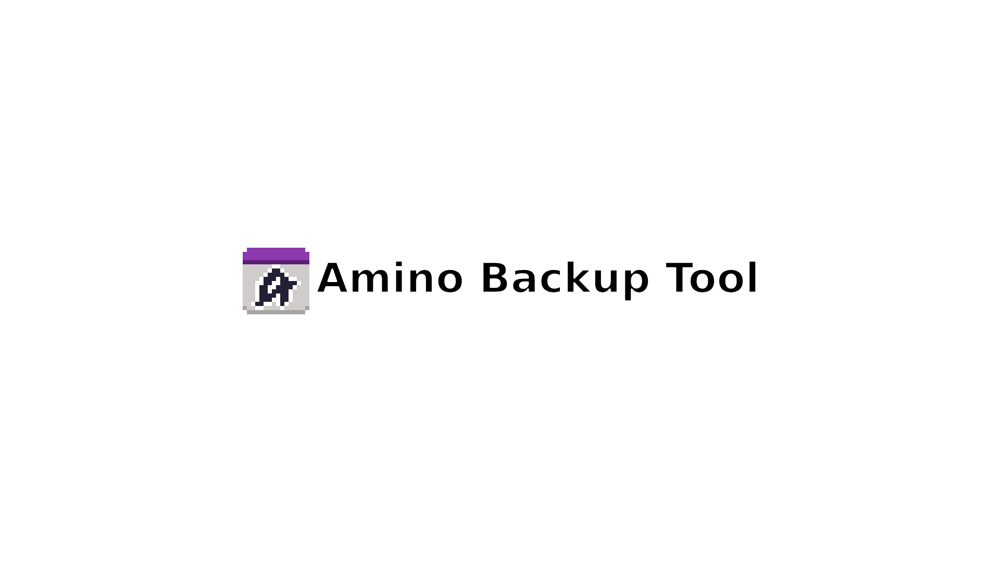
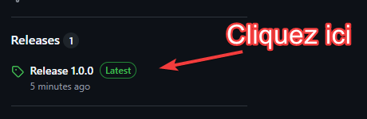
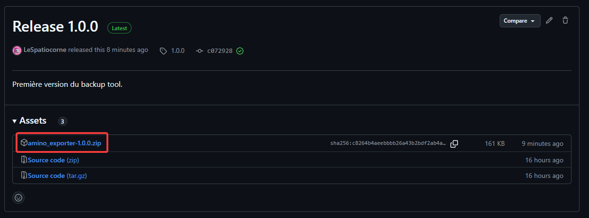
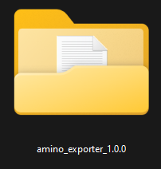
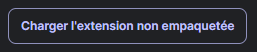
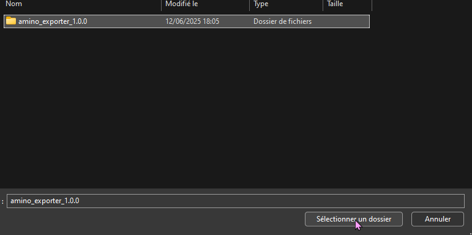
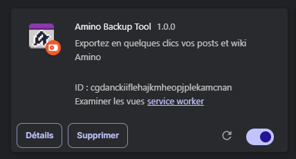

Cette extension est conçue pour les navigateurs tournant sous chromium et n'est pas enpaquetée, vous allez donc devoir l'installer manuellement.
Les navigateur chromium sont tous les navigateurs basé sur le même moteur que Google Chrome, c'est le cas de pas mal d'entre-eux comme ceux-ci :

### Bug connus :
https://github.com/LeSpatiocorne/amino_exporter/issues

# Guide d'installation
Partie I - Téléchargement et extraction
1. Allez dans les "releases"  

2. Téléchargez le fichier zip de la dernière version  

3. Extrayez le dossier où vous voulez sur votre ordinateur (de préférence quelque part où vous saurez le retrouver)  

Partie II - Installation
1. Rendez vous dans votre navigateur et repérez le gestionnaire d'extension 
  Si vous ne trouvez pas du tout vous pouvez aussi essayer l'url <navigateur>://extensions :
    * brave://extensions/
    * chrome://extensions/
    * arc://extensions/
2. Repèrez le petit bouton "activer le mode développeur" et cochez le pour faire apparaitre des nouveaux boutons.  

3. Cliquez sur "Charger l'extension non empaquetée" et naviguez jusqu'au dossier que vous avez extrait précédément  

4. Sélectionnez le dossier et cliquer sur sélectionner un dossier  

# Installation terminée ! 🎉  

Vous pouvez maintenant utiliser l'extension pour télécharger un post ou wiki amino. 
Pensez à l'épingler si vous voulez y avoir accès rapidement !  

# Apperçu

